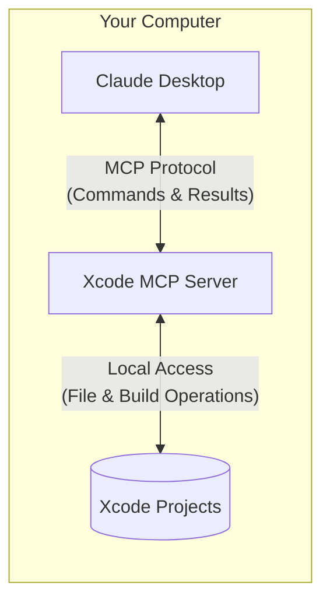
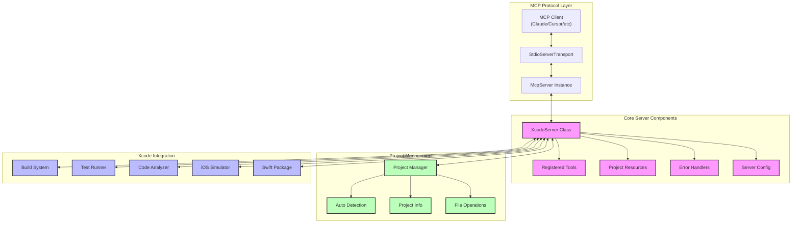

# Xcode MCP Server

<div align="center">
  
</div>

A Model Context Protocol (MCP) server that brings the power of AI to your Xcode projects. This server acts as a bridge between Claude and your local Xcode development environment, enabling intelligent code assistance, project management, and automated development tasks.

<a href="https://glama.ai/mcp/servers/mmxuwmm7sc"></a>

## What is Xcode MCP Server?

At its core, this server follows a client-server architecture where Claude can securely interact with your local Xcode projects:



The communication between the Xcode MCP server and your local projects happens entirely on your machine—your code is not exposed to the internet. The Model Context Protocol ensures that Claude can only perform approved operations through well-defined interfaces, giving you a secure way to let AI assist with your development while maintaining complete control.

## MCP Client Compatibility

This server implements the Model Context Protocol (MCP) specification, making it compatible with any MCP-compliant client or host. While the installation instructions focus on Claude Desktop, you can use this server with:

- Self-built MCP clients
- Cursor AI
- Other MCP-compatible IDEs and tools
- Any application that implements the MCP client specification

The standardized protocol ensures consistent functionality across different clients while maintaining the same level of security and local-only operation.

## Key Features

### 🔍 Intelligent Project Detection
- Automatically finds and connects to your active Xcode project
- Supports manual project selection for precise control
- Maintains workspace context across interactions

### 📁 Smart File Operations
- Read and analyze Swift, Objective-C, and project configuration files
- Create and modify source files with proper syntax and imports
- Intelligent file listing with type filtering and search

### 🛠 Project Management
- Access project targets, configurations, and schemes
- Analyze source files for potential issues
- Execute builds with specific configurations
- Run and manage test suites

## Installation

You can install this server in three ways:

### 1. Using Claude Desktop with NPM Package

Update your Claude configuration file (`~/Library/Application Support/Claude/claude_desktop_config.json`):

```json
{
  "mcpServers": {
    "xcode": {
      "command": "npx",
      "args": [
        "-y",
        "xcode-mcp-server"
      ],
      "env": {
        "PROJECTS_BASE_DIR": "/path/to/your/xcode/projects"
      }
    }
  }
}
```

### 2. Global NPM Installation

Install the package globally:

```bash
npm install -g @modelcontextprotocol/xcode-server
```

Then update your Claude configuration:

```json
{
  "mcpServers": {
    "xcode": {
      "command": "xcode-server",
      "env": {
        "PROJECTS_BASE_DIR": "/path/to/your/xcode/projects"
      }
    }
  }
}
```

### 3. From Source

1. Clone this repository:
   ```bash
   git clone https://github.com/r-huijts/xcode-mcp-server.git
   cd xcode-mcp-server
   ```

2. Install dependencies:
   ```bash
   npm install
   ```

3. Set up environment variables:
   ```bash
   cp .env.example .env
   ```
   Edit `.env` and set `PROJECTS_BASE_DIR` to your Xcode projects directory.

4. Build the project:
   ```bash
   npm run build
   ```

Then update your Claude configuration:

```json
{
  "mcpServers": {
    "xcode": {
      "command": "node",
      "args": [
        "/absolute/path/to/xcode-mcp-server/dist/index.js"
      ],
      "env": {
        "PROJECTS_BASE_DIR": "/path/to/your/xcode/projects"
      }
    }
  }
}
```

> **Note**: Replace `/path/to/your/xcode/projects` with the actual path to your Xcode projects directory.

After updating the configuration, restart Claude Desktop for the changes to take effect.

## Working with the Server

The server provides a natural interface for Claude to assist with your Xcode development. Here are some ways you can interact:

### Project Navigation
Ask Claude to:
- "Set my Xcode projects directory to `/Users/username/Documents/XcodeProjects`"
- "What's my current active project?"
- "Switch to the MyApp.xcodeproj project"
- "Show me all Swift files in the project"

### Code Creation & Modification
Get help with:
- "Create a new view called ProfileView with a preview provider"
- "Add a @Published email property to UserModel.swift"
- "Set up a modern async/await networking layer"
- "Implement Core Data models with SwiftUI bindings"

### Project Analysis & Building
Let Claude assist with:
- "Analyze NetworkManager.swift for potential issues"
- "Build the project in Debug configuration"
- "Run the unit tests for the UserModel module"
- "What build schemes are available?"

## Development and Debugging

### Building the Project
```bash
npm run build
```

### Running Tests
```bash
npm test
```

### Troubleshooting
The server provides detailed logging through stderr. Common issues and their solutions:

1. **Project Detection Issues**
   - Verify your projects directory path
   - Ensure Xcode Command Line Tools are installed
   - Check file permissions

2. **Build Problems**
   - Validate Xcode installation
   - Check project configurations
   - Review build settings

## Contributing

We welcome contributions! Whether it's:
- 🐛 Bug fixes
- ✨ New features
- 📚 Documentation improvements
- 🧪 Additional tests

Feel free to submit a Pull Request.

## Technical Details

### Architecture

The Xcode MCP Server follows a modular architecture that enables seamless integration between Claude and your Xcode development environment:



#### Component Description

1. **MCP Protocol Layer**
   - Handles communication between clients and the server
   - Implements the Model Context Protocol specification
   - Manages data serialization and transport

2. **Core Server Components**
   - `XcodeServer`: Main server class orchestrating all operations
   - `Tools`: Collection of registered MCP tools for Xcode operations
   - `Resources`: Project-related resources and metadata
   - `ErrorHandling`: Custom error types and error management
   - `Config`: Server configuration and environment settings

3. **Project Management**
   - Project detection and selection
   - File system operations and project structure
   - Project information and metadata management
   - File reading, writing, and analysis

4. **Xcode Integration**
   - Build system integration
   - Test execution and reporting
   - Code analysis and diagnostics
   - iOS Simulator management
   - Swift Package Manager integration

## License

This project is licensed under the MIT License - see the [LICENSE](LICENSE) file for details.
