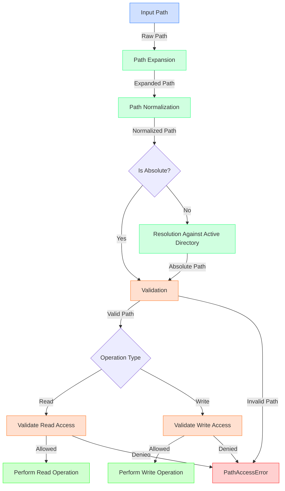

The diagram shows the flow of path resolution in our system:

1. Starting with the raw input path
2. Expanding environment variables and tildes
3. Normalizing the path (removing redundancies)
4. Determining if it's absolute or needs resolution
5. Validating against security boundaries
6. Performing the appropriate operation if valid

Colors indicate:
- Blue: Input
- Green: Processing
- Orange: Validation
- Red: Error
- Bright Green: Success 